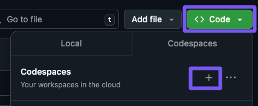

## Uruchom Codespaces

Uruchom Codespaces korzystając z `Code` -> `Codespaces` -> `New codespace` (przycisk `+`).



## Po starcie

```bash
az login
sudo az aks install-cli
```

## Zadania

[0️⃣1️⃣ - Tworzenie i zarządzanie Pod w Kubernetes](/exercises/01-pod/README.md)
[0️⃣2️⃣ - Zmienne środowiskowe i ConfigMap w Kubernetes](/exercises/02-config/README.md)
[0️⃣3️⃣ - Secrets i Certyfikaty TLS w Kubernetes](/exercises/03-secrets/README.md)
[0️⃣4️⃣ - Zarządzanie zasobami w Kubernetes: Resources, Limits i QoS](/exercises/04-resources/README.md)
